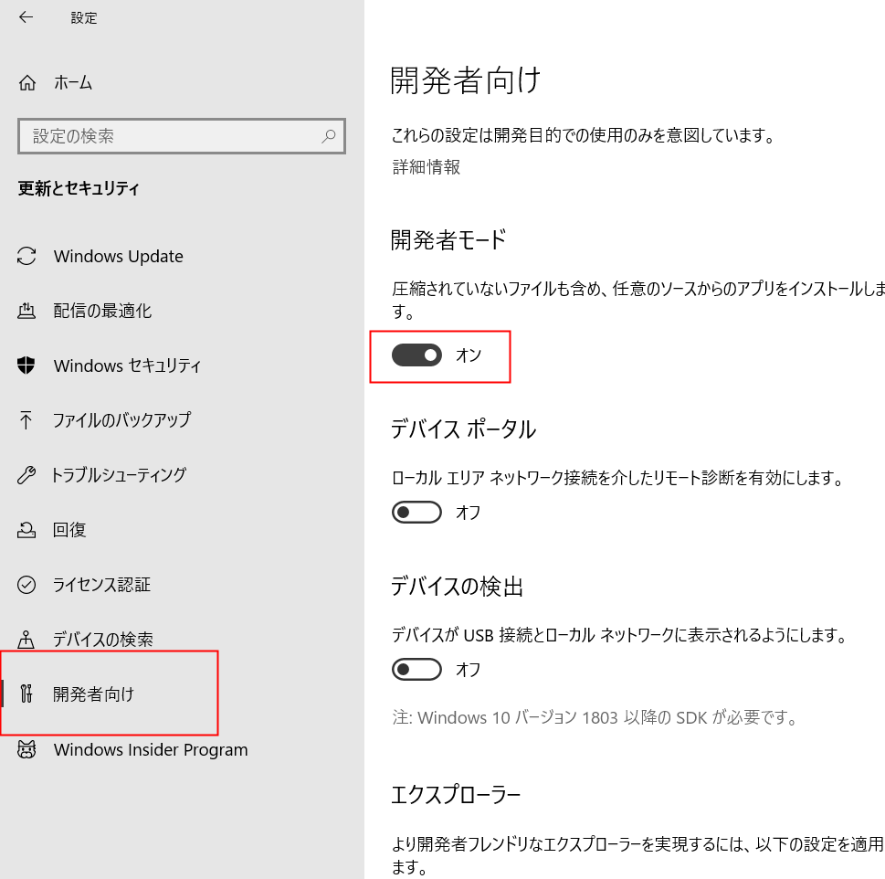
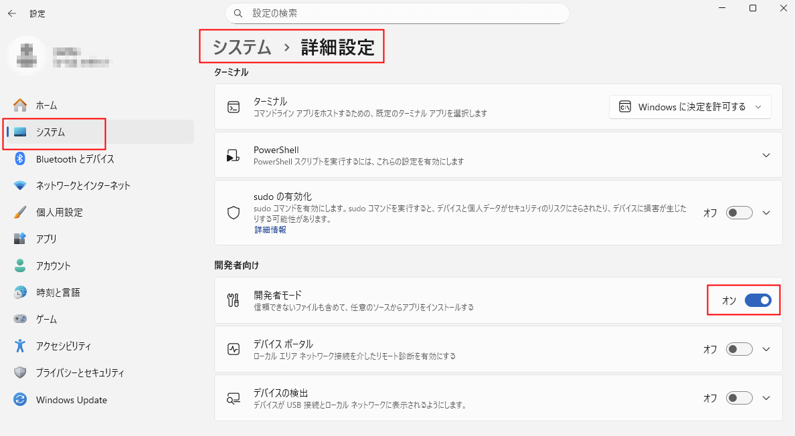

# Export Link プラグイン

## 概要
Eagle で選択したアイテムを、シンボリックリンクまたはハードリンクとして指定フォルダに出力します。

## 使い方
1. Eagle でリンク化したいアイテムを選択します。
2. プラグインを開き、`Symlink` または `Hard Link` を選びます。
3. `Export Selected` をクリックします。
4. 出力先フォルダを選択します。

選択中のフォルダがある場合は、出力先に同名のサブフォルダを作成してリンクを出力します。  
フォルダが選択されていない場合は、出力先ルートに直接出力します。

## 注意点
- **ハードリンクは同じディスク内でのみ作成できます。**
- **シンボリックリンクは Windows の「開発者モード」が必要な場合があります。**

## エラー時
- `operation not permitted` が出た場合は、表示される URL を参考に Windows の開発者モードを有効にしてください。
- `EXDEV: cross-device link not permitted` が出た場合は、同じディスクを出力先に指定してください。

## windowsの開発者モード
### windows 10 手順

1. **スタートメニュー**を開き、⚙️ **設定** をクリックする  
2. **更新とセキュリティ** を選択  
3. 左側メニューから **開発者向け** をクリック  
4. **開発者モード** を選択する  
5. 確認ダイアログが表示されたら **はい** をクリック

### windows 11 手順 

1. **スタートメニュー**を開き、⚙️ **設定** をクリック  
2. 左側メニューから **システム** を選択  
3. **詳細設定** をクリック  
4. **開発者モード** のトグルを **オン** にする  
5. 確認ダイアログが表示されたら **はい** をクリック

